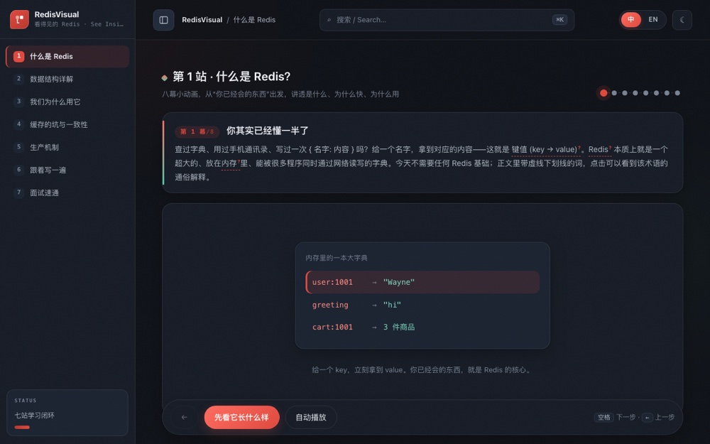
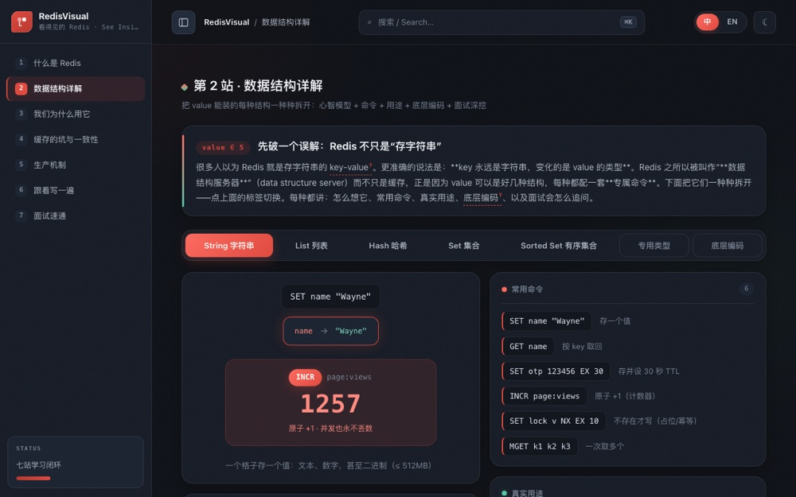

# RedisVisual — See Inside Redis

**▶ [Open the course](https://redis-visual.vercel.app)** — runs in your browser, nothing to install.

An interactive Redis course for people starting from zero. It plays the whole thing back
in slow motion: what Redis is, why it is fast, why a real system (WeShipItNow) reaches for
it, and finally how to write it yourself and talk about it in an interview — about 40
minutes end to end, starting from things you already know.



*Stop one: what Redis is, in eight animated scenes*



*The data structures, each with its own animation and commands*

## Stops

1. **`/` — What Redis is.** Eight short animated scenes: a dictionary → SET/GET →
   warehouse vs. workbench → how fast memory really is → a short command path and a single
   thread → the five data structures → the acceleration layer → the one-sentence definition.
2. **`/data` — The data structures.** The five core types (String, List, Hash, Set, Sorted
   Set), the specialised ones (Bitmap, HyperLogLog, Geo, Stream), and the encodings
   underneath. Each with an animation, its commands, what it is for, and the interview
   follow-ups.
3. **`/scenarios` — Why we use it.** Back to WeShipItNow, three real uses animated end to
   end: caching shipping quotes (cache-aside), making label purchases idempotent (SET NX),
   and the balance projection.
4. **`/pitfalls` — Cache failures and consistency.** Penetration, breakdown and avalanche;
   database/cache double-write consistency (delayed double delete); hot keys and big keys.
5. **`/internals` — Production mechanics.** Persistence (RDB/AOF), expiry and eviction
   policies, high availability (replication, Sentinel, Cluster), and transactions
   (MULTI, WATCH, Lua, pipelining, distributed locks).
6. **`/code` — Write it yourself.** Step by step: open VS Code → start Redis in Docker →
   set up a Node/TypeScript project → write the code → run it → watch what happens through
   `redis-cli`. Lines light up as you go, with terminal output replayed.
7. **`/interview` — Interview prep.** 26 frequently asked questions, grouped and
   expandable, plus a summary — enough to hold the conversation in English.

## Running locally

Requires Node 22 (an `.nvmrc` is included):

```bash
nvm use          # switch to Node 22
npm install
npm run dev      # http://localhost:3000
```

Build with type checking: `npm run build`.

## Structure

Next.js 15 (App Router) + TypeScript + React 19, plain CSS.

Each stop is one group of three files — data, page, and its own stylesheet:

| Data | Page | Styles |
|---|---|---|
| `lib/intro.ts` | `app/page.tsx` | `app/home.css` |
| `lib/datalab.ts` | `app/data/page.tsx` | `app/data/data.css` |
| `lib/scenarios.ts` | `app/scenarios/page.tsx` | `app/scenarios/scenarios.css` |
| `lib/pitfalls.ts` | `app/pitfalls/page.tsx` | `app/pitfalls/pitfalls.css` |
| `lib/internals.ts` | `app/internals/page.tsx` | `app/internals/internals.css` |
| `lib/codelab.ts` | `app/code/page.tsx` | `app/code/code.css` |
| `lib/interview.ts` | `app/interview/page.tsx` | `app/interview/interview.css` |

The shell ("Research OS"): sidebar in `app/sidebar.tsx`, toolbar in `app/toolbar.tsx`,
command palette (⌘K) in `app/command-palette.tsx`, theme and UI state in
`app/theme-provider.tsx`.

Bilingual throughout via `lib/i18n.tsx` — every string is a `{ zh, en }` pair. The glossary
lives in `lib/glossary.tsx`; writing `[[key:label]]` in body text renders a clickable term
that pops up its explanation.

Design tokens and shared component styles are in `app/globals.css`; each stop keeps its own
animations in its own stylesheet.

---

© 2026 Weiren Feng. All rights reserved. Published for reading and portfolio purposes; not
licensed for reuse, modification, or redistribution.
