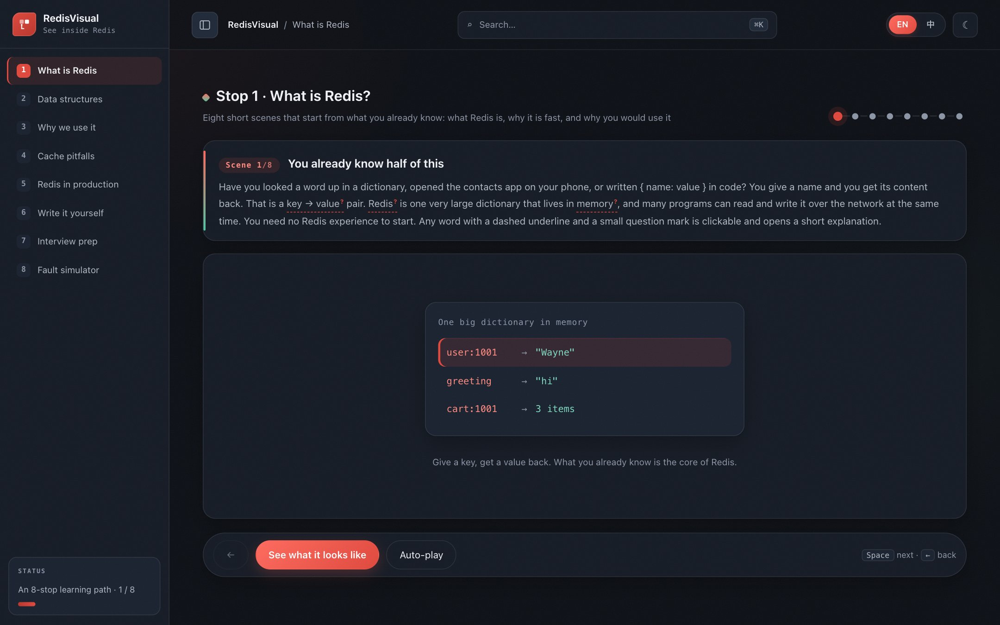
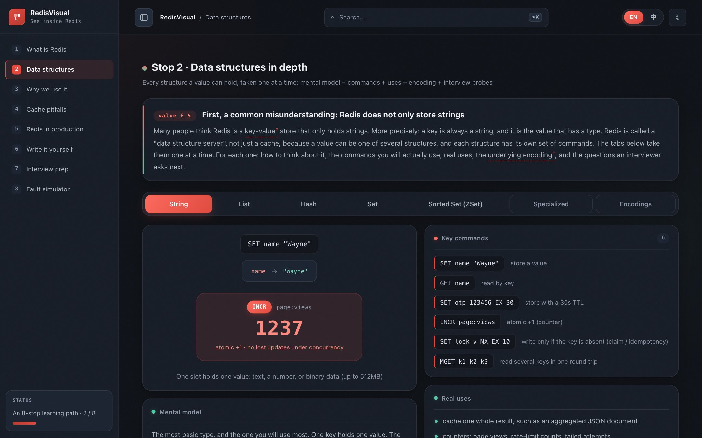
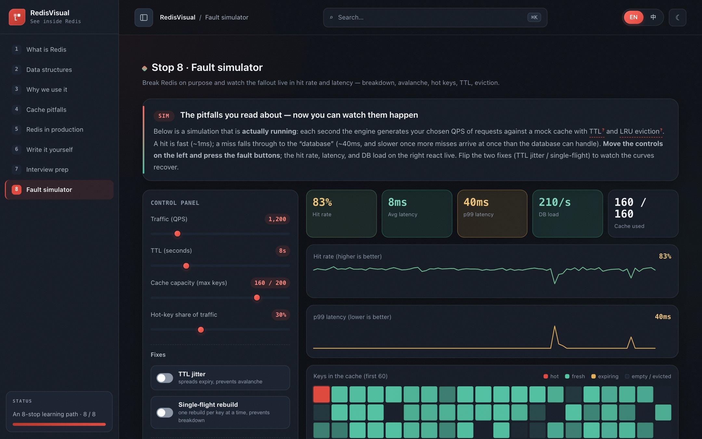

# RedisVisual — See Inside Redis

**▶ [Open the course](https://redis-visual.vercel.app)** — runs in your browser, nothing to install.

An interactive introduction to Redis, covering its core data structures, common application
patterns, operational trade-offs, a guided local implementation, and a running simulator where
you break the cache on purpose and watch hit rate and latency react.



*Stop one: what Redis is, in eight animated scenes*



*The data structures, each with its own animation and commands*



*Stop eight: trigger a fault and watch hit rate, latency and DB load react — then flip TTL jitter or single-flight and watch the curves recover*

## Stops

1. **`/` — What Redis is.** Eight short animated scenes: a dictionary → SET/GET →
   warehouse vs. workbench → how fast memory really is → a short command path and a single
   thread → the five data structures → the acceleration layer → the one-sentence definition.
2. **`/data` — The data structures.** The five core types (String, List, Hash, Set, Sorted
   Set), the specialised ones (Bitmap, HyperLogLog, Geo, Stream), and the encodings
   underneath. Each with an animation, its commands, what it is for, and the interview
   follow-ups.
3. **`/scenarios` — Why we use it.** Back to WeShipItNow, three real uses animated end to
   end: caching shipping quotes (cache-aside), making label purchases idempotent (SET NX),
   and the balance projection.
4. **`/pitfalls` — Cache failures and consistency.** Penetration, breakdown and avalanche;
   database/cache double-write consistency (delayed double delete); hot keys and big keys.
5. **`/internals` — Redis in production.** Persistence (RDB/AOF), expiry and eviction
   policies, high availability (replication, Sentinel, Cluster), and transactions
   (MULTI, WATCH, Lua, pipelining, distributed locks).
6. **`/code` — Write it yourself.** Step by step: open VS Code → start Redis in Docker →
   set up a Node/TypeScript project → write the code → run it → watch what happens through
   `redis-cli`. Lines light up as you go, with terminal output replayed.
7. **`/interview` — Interview prep.** 26 review questions, grouped and expandable, with concise English summaries.
8. **`/simulator` — Fault simulator.** The pitfalls from stop four, running. A deterministic
   engine drives your chosen QPS against a mock cache with TTL and LRU eviction; trigger a
   breakdown, an avalanche, a hot key or a three-second outage and watch hit rate, latency
   and DB load react live. Two fixes — TTL jitter and single-flight rebuild — are switches,
   so the recovery is something you measure rather than something the page claims.

## Running locally

Requires Node 22 (an `.nvmrc` is included):

```bash
nvm use          # switch to Node 22
npm install
npm run dev      # http://localhost:3000
```

Build with type checking: `npm run build`. Unit tests: `npm test` (Vitest). Browser tests:
`npm run test:e2e` (Playwright).

## Structure

Next.js 15 (App Router) + TypeScript + React 19, plain CSS.

Each stop is one group of three files — data, page, and its own stylesheet — plus a small
`layout.tsx` in the stop's folder that sets its page title:

| Data | Page | Styles |
|---|---|---|
| `lib/intro.ts` | `app/page.tsx` | `app/home.css` |
| `lib/datalab.ts` | `app/data/page.tsx` | `app/data/data.css` |
| `lib/scenarios.ts` | `app/scenarios/page.tsx` | `app/scenarios/scenarios.css` |
| `lib/pitfalls.ts` | `app/pitfalls/page.tsx` | `app/pitfalls/pitfalls.css` |
| `lib/internals.ts` | `app/internals/page.tsx` | `app/internals/internals.css` |
| `lib/codelab.ts` | `app/code/page.tsx` | `app/code/code.css` |
| `lib/interview.ts` | `app/interview/page.tsx` | `app/interview/interview.css` |
| `lib/simulator.ts`, `lib/simulator/engine.ts` | `app/simulator/page.tsx` | `app/simulator/simulator.css` |

The shell ("Research OS"): sidebar in `app/sidebar.tsx`, toolbar in `app/toolbar.tsx`,
command palette (⌘K) in `app/command-palette.tsx`, theme and UI state in
`app/theme-provider.tsx`.

Bilingual throughout via `lib/i18n.tsx` — every string is a `{ zh, en }` pair. English is the
default; the `English / Chinese` switch in the toolbar stores the choice in `localStorage`, and a small
inline script at the top of `<body>` applies it before the first paint so the page never flashes the
wrong language. The glossary lives in `lib/glossary.tsx`; writing `[[key:label]]` in body text renders
a clickable term that pops up its explanation.

Design tokens and shared component styles are in `app/globals.css`; each stop keeps its own
animations in its own stylesheet.

---

© 2026 Weiren Feng. All rights reserved. Published for reading and portfolio purposes; not
licensed for reuse, modification, or redistribution.
